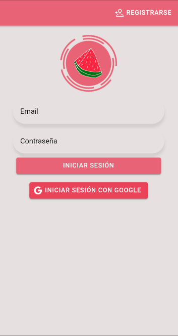
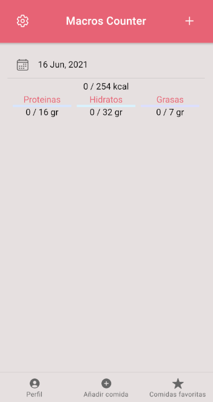
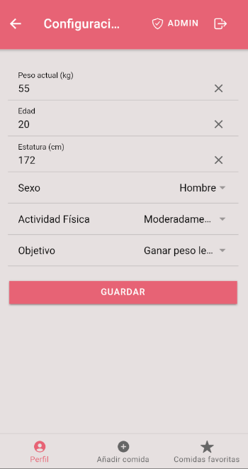
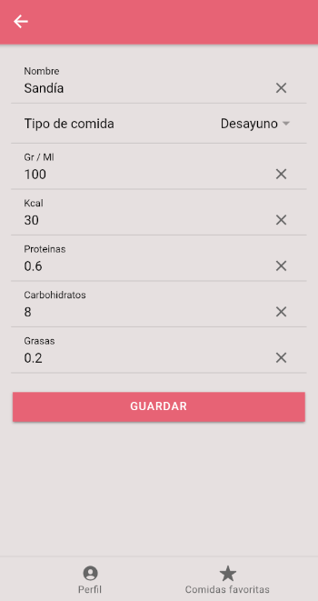
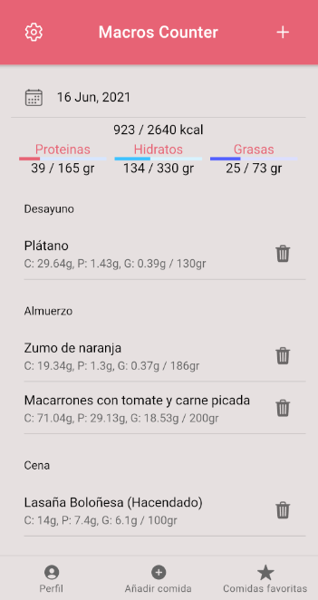
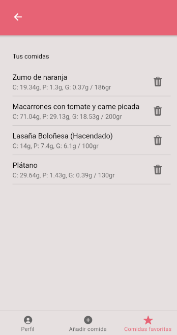
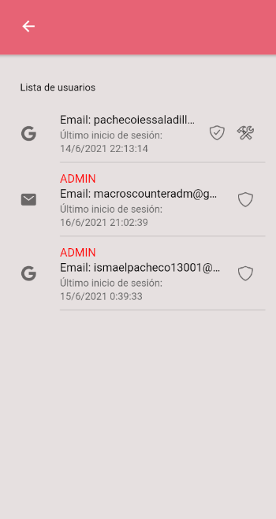

# Macros Counter

  < /br>
  <a href="https://ismaelpacheco13.github.io/macros-counter-ionic-final-landing-page/">Landing Page</a>

# Sobre el proyecto

Macros Counter es una aplicación con la que podrás calcular los macros de tus comidas diariamente. Podrás llevar un seguimiento diario de las kcal que ingieres y distribuir los carbohidratos, proteinas y grasas a tu gusto.

Dentro de la aplicación tendrás que configurar tu perfil basado en tu altura, peso, edad y objetivo (subir peso o bajar peso (rapida o lentamente) o mantenerte), con estos datos Macros Counter calculará las kcal diarias que debes ingerir y las dividirá en la cantidad en gramos de proteinas, hidratos de carbono y grasas que debes ingerir diariamente dependiendo de tu objetivo.

Si consigues llegar a las kcal que se te marcan diariamente, insertando las comidas que vayas haciendo a lo largo del día (desayuno, merienda, cena..), verás como logras tu objetivo y subes o bajas de peso facilmente.

# Tecnologías usadas

# Uso de la aplicación

## Login Page

Al entrar por primera vez en la aplicación deberás de iniciar sesión con tu cuenta o con tu cuenta de Google (no necesita registro) o registrarte con un correo y contraseña para poder acceder.

## Home Page (vacía)

Mas o menos esto sería lo que verías al acceder por primera vez (exceptuando los macros que ya estan configurados).
Esta es la pantalla principal de la aplicación sin ningún alimento insertado. Desde esta página verás los alimentos que hayas insertado en el día que este seleccionado en la parte superior,
los macros totales que deberás ingerir dependiendo de tu configuración y los macros que llevas ingeridos en el día. Las barras se actualizarán inmediatamente al añadir, eliminar alimentos o cambiar tu perfil.

## Profile Page

Esta es la pantalla de perfil/configuración, en ella deberás de insertar tus objetivos así como tu actividad física, edad, peso, altura..
Con estos datos Macros Counter calculará las kcal, carbohidratos, proteinas y grasas que deberás ingerir cada día para lograr tu objetivo.

## Add/Edit Page

Desde esta pestaña podrás añadir las comidas que vayas ingiriendo o editar las comidas que ya hayas insertado en la página principal de la aplicación.

## Home Page (ejemplo con datos)

Este sería un ejemplo de página principal con el perfil ya configurado y con algunas comidas de ejemplo insertadas.
Como se puede apreciar, el progreso de las barras aumenta al ir insertando comidas y irse acercando a los macros que Macros Counter ha calculado para tí.
Desde esta página podrás editar cada una de las comidas que hayas insertado pulsando encima de cada una de ellas y eliminarlas pulsando sobre el iconito de la papelera.

## Favourite Page

Desde la pestaña de comidas favoritas (que podrás acceder desde la parte inferior de la app), podrás encontrar las comidas que hayas ido insertando para poder añadirlas nuevamente fácilmente y no tener
que insertar los datos uno a uno de nuevo, esto es muy útil para poder insertar la misma comida en otro momento del día o en otro día diferente.
Por supuesto, también podrás borrar la comida de tus comidas favoritas en caso de no querer tenerla ahí.

## Admin Page

Desde esta página que se accede desde la parte superior derecha de la pestaña de configuración (solo tienen acceso a ella los usuarios administradores), podrás ver una lista de usuarios y realizar ciertas acciones sobre ellos.
De cada usuario podrás ver varios datos presionando sobre ellos (email, uid, último inicio de sesión..) además de saber si es un usuario registrado con email y contraseña o con cuenta de google (iconito a la izquierda de cada usuario).
También podrás eliminar su configuración o sus comidas favoritas presionando sobre el iconito de las herramientas a la derecha del usuario (solo usuarios no admins), o ascender o descender el usuario a administrador o usuario respectivamente (iconito del escudo).

# APK
Puedes descargar la APK desde [aquí](media-readme/macrosCounter.apk).

# Presentacion PDF
La presentación en PDF se encuentra [aquí](media-readme/presentacion.pdf).

# Vídeo descriptivo

# Bibliografía
- [Ionic Docs](https://ionicframework.com/docs)
- [PositronX.io (Firebase Auth)](https://www.positronx.io/ionic-firebase-authentication-tutorial-with-examples/)
- [PositronX.io (Firebase Realtime Database)](https://www.positronx.io/build-ionic-firebase-crud-app-with-angular/) + muchos post de stackoverflow para arreglar bugs de versiones, algunos métodos, etc..
- [Codetrix (Capacitor-Google-Auth)](https://www.npmjs.com/package/@codetrix-studio/capacitor-google-auth)
- [StackOverflow (Various Bugs Fixes)](https://es.stackoverflow.com/)