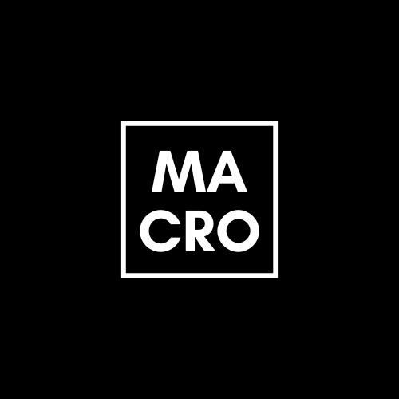
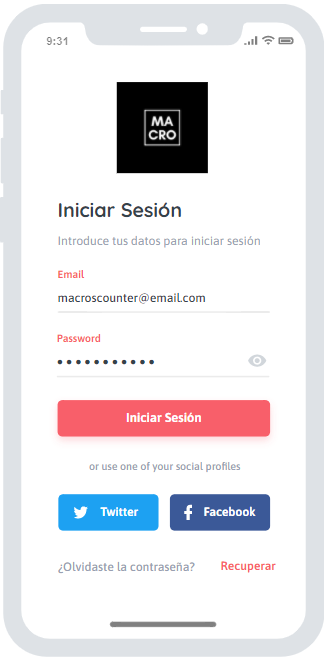
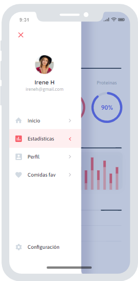
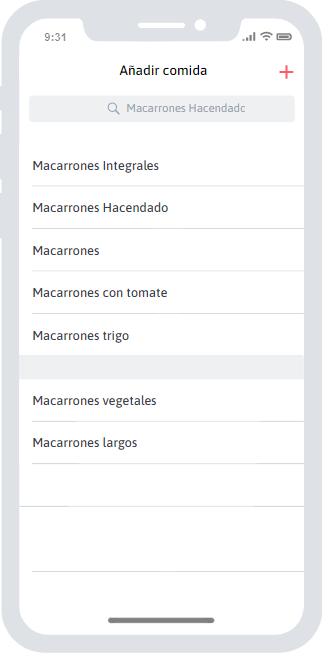

# Macros Counter

  

# Sobre el proyecto

Macros Counter es una aplicación con la que podrás calcular los macros de tus comidas diariamente. Podrás llevar un seguimiento diario de las kcal que ingieres y distribuir los carbohidratos, proteinas y grasas a tu gusto.

# Tecnologías usadas

# Mockup

