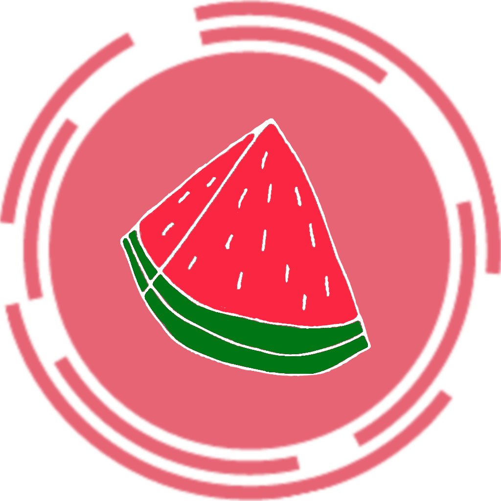

# Macros Counter

  

# Sobre el proyecto

Macros Counter es una aplicación con la que podrás calcular los macros de tus comidas diariamente. Podrás llevar un seguimiento diario de las kcal que ingieres y distribuir los carbohidratos, proteinas y grasas a tu gusto.

Dentro de la aplicación tendrás que configurar tu perfil basado en tu altura, peso, edad y objetivo (subir peso o bajar peso (rapida o lentamente) o mantenerte), con estos datos Macros Counter calculará las kcal diarias que debes ingerir y las dividirá en la cantidad en gramos de proteinas, hidratos de carbono y grasas que debes ingerir diariamente dependiendo de tu objetivo.

Si consigues llegar a las kcal que se te marcan diariamente, insertando las comidas que vayas haciendo a lo largo del día (desayuno, merienda, cena..), verás como logras tu objetivo y subes o bajas de peso facilmente.

# Tecnologías usadas

# Mockup

# Objetivos

Crear una app funcional con la que se pueda llevar un recuento diario de todas las comidas:

- Cuente con una base de datos con alimentos preestablecidos (con sus kcal, proteinas, hidratos...)
- Que todo el mundo pueda insertar alimentos en la base de datos y les aparezca posteriormente a los otros usuarios por si el alimento y sus macros coincide no tener que insertarlo manualmente. (ESTO NO QUIERE DECIR QUE LOS USUARIOS PUEDAN ACCEDER A LA BASE DE DATOS Y MODIFICARLA)
- Se guarde en la base de datos todas las comidas que vayas insertando, separadas por cada día, y que puedas consultarlas desde cualquier otro día.
- Se guarde en la base de datos el perfil con tu configuración (kcal que necesitas comer, peso, edad...)
